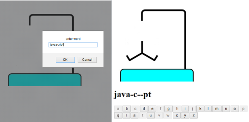

hangman
=======

This is my second javascript project which is a simple hangman game. When the program starts it asks you to input the word you want the other player to guess.
This can be one word or any number of words. It then converts the characters in this word to dashes( not including spaces) so the word is hidden.
On the screen there are 26 buttons for each of the letters of the alphabet which the player can click on to see if that letter is in the hidden word.
After a letter is clicked on it is disabled. If the letter isn't in the hidden word then the next hangman image is displayed. You have six wrong guesses before the person is hung and an alert tells you you have lost.

JS Used:
* goes through inputted text and replaces each character with a "-" or a blank space if it is a space, to create a hidden word or words.
* uses a for loop to create the 26 buttons for each of the letters in the alphabet.
* after the button has been clicked it disables the button.
* uses prompt.
* uses innerHTML.
